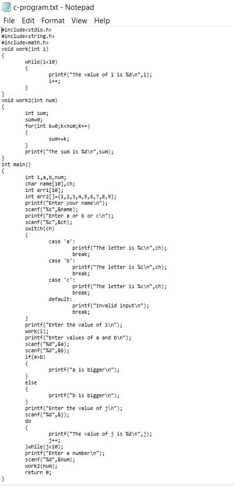
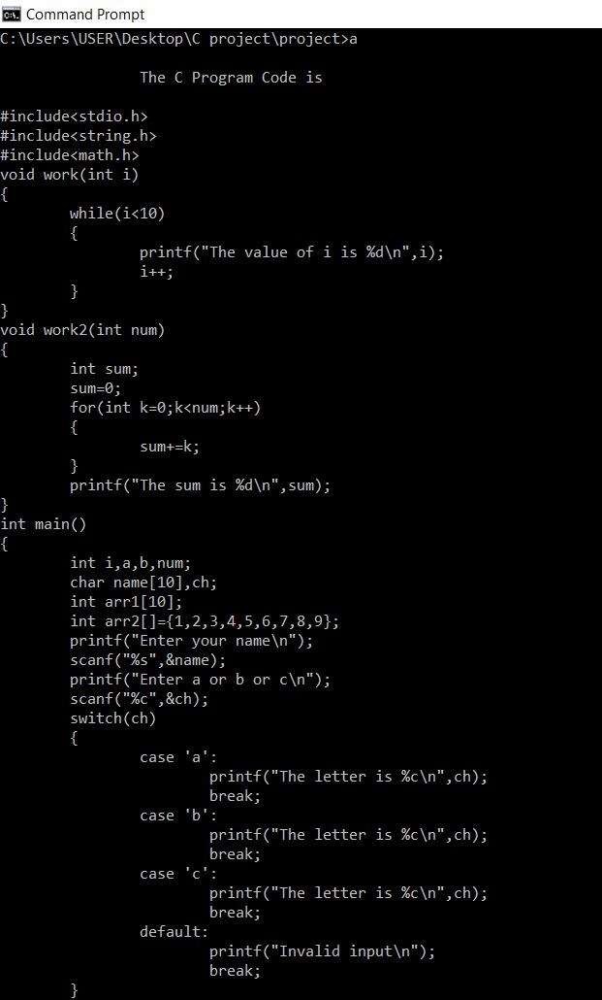
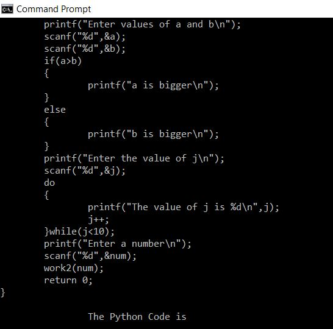
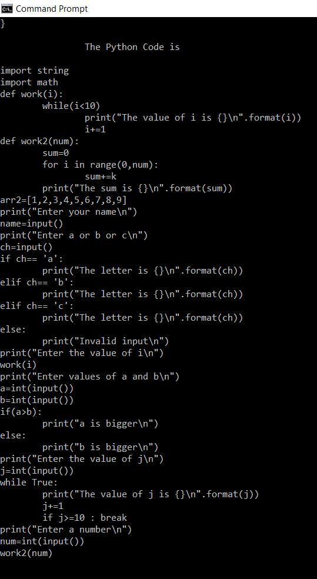
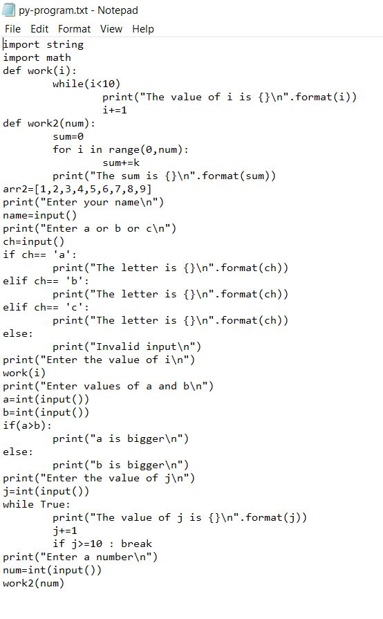

# C to Python Translator
## Summary:
Using FIle I/O we were able to convert C code written in one text file to Python code in another text file with the application of multiple function that could identify and accordingly process specific key words and formats used in the C language.

## Developed By:
1.	Daniel Lester Saldanha - [Linkedin](https://www.linkedin.com/in/daniel-saldanha-31660a19a/) , [DAN-329](https://github.com/DAN-329)
2.	Abhiram Prakash Alamuri – [Linkedin](https://www.linkedin.com/in/abhiram-prakash-alamuri-43289a1a6/), [abhiramalamuri2](https://github.com/abhiramalamuri2)

## Problem Statement:
This project deals with the translation of code written in the C Programming Language to Python code.
## Description:

*	The main objective of this project is the line by line conversion of code written in C to Python syntax.

*	This project can come in handy for a student learning the C-Programming Language with prior programming experience in Python. It will allow the student to easily draw parallels between the two syntaxes.

*	It can also be used in the industry for comparing the two syntaxes and their compilation properties.

*	Various functions have been defined in order to translate every part of a C program to Python. For example, the function, conditionConvert(), converts if - else if - else statements written in C to if – elif – else statements in Python.

*	2-Dimentional strings have been used to simplify iterations and nested iterations in the code.

*	The program is executed by reading from a text file that consist of the C code to be translated and the translated code is written to an output file. 

## Concepts Used:
### Function: 
For every in-built function or control structure, a function has been defined which converts the C code into Python Syntax.

```
whiledo(a,&n);

swch(a,&n);
 
listConvert(a,&n);

variable(a,&n);

printFunction(a,&n); 
```

### 2-Dimentional strings:
C allows the user to store data in 2-Dimentional strings. A 2-Dimentional string consist of an array, each of whose elements in one line of C-code. The program reads each line of code and applies the appropriate function to that string.
```
char a[200][100],str[100],ch;
```

### File I/O:
The program reads from a file that contains the C code as a 2-Dimentional string, converts the code to Python and writes the output to an output file.
```
fprintf(f2,"%s",a[i]);
fprintf(f2,"%c",'\n');
```
### Control Structures:
Various control structures such as For loops, While loops and Switch – case were used within the project.
```
for(int j = 0; j<strlen(inputData[i]); j++)
			{
				if(inputData[i][j] == '<' && inputData[i][j+1] == '=')
				{
					strcat(innerStringTwo, "+1");
				}
			}
 ```
### string.h library:
Various functions from string.h were used in the program. For example, strlen, strcat, strcpy, strcmp and strncat were used.
```
strcat(inputData[i], " in range(");
```
### Pointers: 
Pointers were used for inter-functional data usage. Data obtained from the user in main() was used in the other functions that were defined. This could be done only with the help of pointers.
```
void variable(char a[200][100],int *num)
```
## Learning Outcome:
*	Usage of 2-Dimentional strings in the C Programming Language
*	Handling File Input and Output – Reading and writing to files
*	Usage of the string library and its functions - strlen, strcat, strcpy, strcmp and strncat.
*	Defining Functions with character array input.

## Output Screenshots:
 


<p align="center">Fig 1: c-program.txt (Input file)</p>



<p align="center">Fig 2: Program execution</p>



<p align="center">Fig 3: Program execution</p>
 


<p align="center">Fig 4: Program execution (Final Output)</p>



<p align="center">Fig 5: py-program.txt (Output file)</p>
